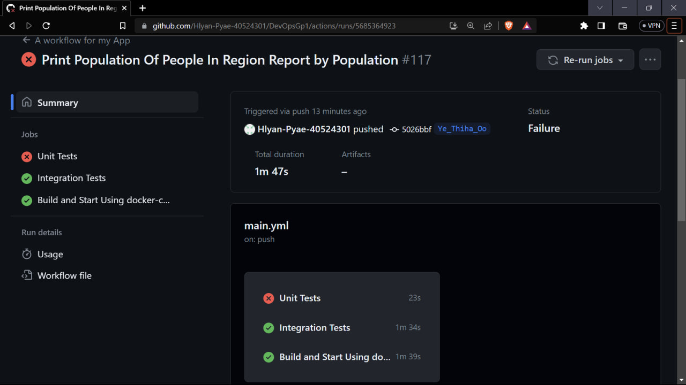

**Describe the bug**
When pushing changes to a repository, GitHub Actions jobs occasionally fail, but re-running the failed jobs results in an automatic change to successful status. This behavior is inconsistent and raises concerns about the reliability of the build and test processes.

**To Reproduce**

1. Make changes to the codebase and push the changes to the repository.
2. Observe the GitHub Actions jobs and check for any failures.
3. Re-run the failed jobs using the GitHub Actions interface.
4. Observe that the re-run jobs now show as successful, even though they originally failed.

**Expected behavior**
GitHub Actions jobs should produce consistent and reliable results. If a job fails during the initial run, re-running the job should yield the same outcome – a failure status – and not automatically change to successful status.

**Screenshots**
Before solve error

After solve error

**Desktop (please complete the following information):**
 - OS: [Windows 10]
 - Browser [Firefox]
 - Version [MSI]

**Additional context**
  .  The issue occurs randomly and is not specific to a particular repository or workflow setup.
  . The jobs fail due to legitimate issues such as build errors or test failures, and the original failure status is expected.
  .  The re-run jobs do not appear to execute any changes or fixes to the codebase or configurations.
  .  This issue impacts the development workflow, as it makes it difficult to identify and address genuine failures in a timely manner.
  .  Failing jobs should be treated as indicators of potential problems that require investigation and resolution, rather than being automatically marked as successful without validation.
